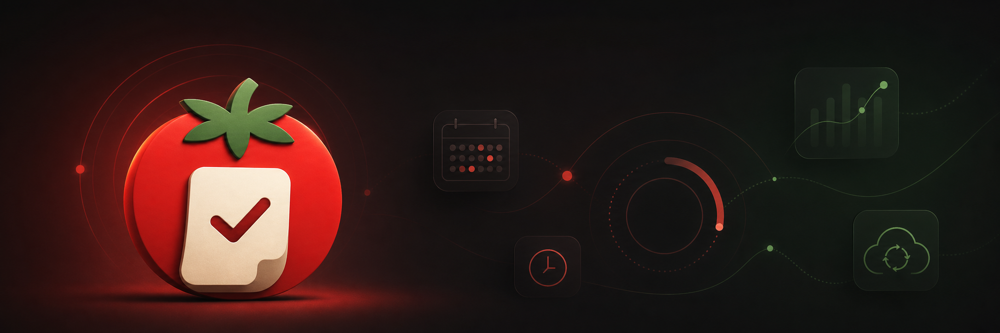

<p align="center">
  
</p>

<h1 align="center">Tomatolog · 番茄日志</h1>

<p align="center">
  一款本地优先、支持 WebDAV 同步的分类番茄钟与时间日志 App。<br>
  让每一次专注都有记录，让时间真正可见。
</p>

<p align="center">
  
  
  
  
</p>

<p align="center">
  <a href="https://github.com/WJMA-GIT/tomatolog/releases/latest"><strong>下载最新 Android 安装包</strong></a>
  ·
  <a href="https://github.com/WJMA-GIT/tomatolog/releases">查看更新日志</a>
</p>

---

## 为什么选择 Tomatolog？

Tomatolog 不只是一个倒计时器。它把专注计时、分类管理、计划安排、时间日志和趋势统计串成一条完整的时间管理链路，同时坚持本地优先：你的数据默认留在设备上，需要跨设备时再由你选择自己的 WebDAV 服务。

| 专注与计划 | 日志与洞察 |
| --- | --- |
| 🍅 **灵活计时**：15、25、45 分钟专注周期，支持暂停、继续和中断 | 📝 **自动记录**：计时结束自动生成日志，也支持手动补记 |
| 🗂️ **分类体系**：自定义名称、颜色与图标，支持归档和恢复 | 📊 **多维统计**：日、周、月趋势与分类占比一目了然 |
| 📅 **每日计划**：在指定日期范围内安排每天的目标时段 | 🎨 **沉浸体验**：浅色、纯黑暗色主题与自定义背景图 |
| 🔔 **原生通知**：Android 倒计时通知与 Android 16 实况通知 | ☁️ **自主同步**：WebDAV 合并同步、自动备份、恢复与本地导出 |

## 数据由你掌控

- **本地优先**：核心数据保存在设备本地，无需注册账号。
- **自选云端**：可连接支持 WebDAV 的服务，同步数据或保存独立备份。
- **安全凭据**：WebDAV 密码通过系统安全存储保存，不写入普通配置。
- **冲突保护**：同步过程使用远端校验信息，避免静默覆盖刚发生的修改。

## 获取安装包

每次代码推送到 `main` 后，GitHub Actions 会自动：

1. 递增版本号并生成对应 Git 标签；
2. 在云端构建签名的 `arm64-v8a` Release APK；
3. 根据提交记录生成更新日志；
4. 将 APK 发布到 [GitHub Releases](https://github.com/WJMA-GIT/tomatolog/releases)；
5. 把发布后的版本号同步回 `pubspec.yaml`。

> 当前自动发布的 APK 面向 64 位 ARM Android 设备。

## 本地开发

需要 Flutter stable、Android Studio 和 Android SDK。

```powershell
flutter pub get
flutter run
```

提交前验证：

```powershell
flutter analyze
flutter test
```

## 技术栈

- Flutter / Dart
- Android Kotlin 原生通知桥接
- SharedPreferences 本地持久化
- Flutter Secure Storage 凭据存储
- HTTP / WebDAV 同步与备份
- GitHub Actions 自动签名与发布

<details>
<summary><strong>项目结构</strong></summary>

```text
lib/
  controllers/  业务状态、计时与持久化协调
  models/       分类、计划和时间日志数据模型
  screens/      首页、计时、日志、统计、分类与设置
  services/     本地存储、WebDAV 与原生平台桥接
  ui/           通用显示工具
  widgets/      可复用界面组件
```

</details>

---

<p align="center">
  <br>
  <sub>专注当下，记录时间。</sub>
</p>
